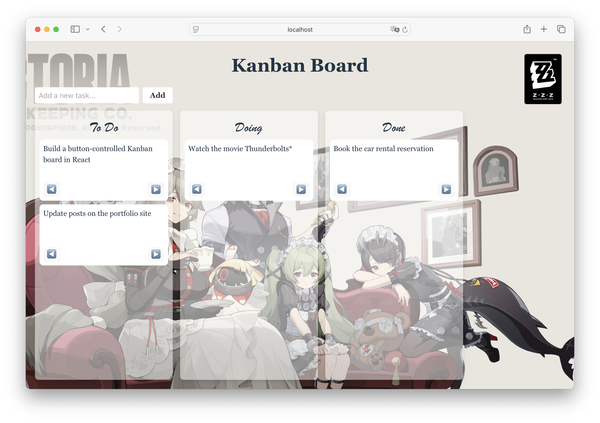

# Button-Driven Kanban

Button-Driven Kanban is a frontend application that tracks to-do tasks in a cleaner way.

## Motivation

Previously, I built a [drag-and-drop kanban](https://github.com/Yuanlong-Tony-Cui/kanban-board) using vanilla JavaScript and Web APIs, which offers a highly interactive and intuitive user experience, especially on desktop.

However, drag-and-drop introduces significant challenges when it comes to accessibility and mobile compatibility. It becomes difficult—or even unusable—for keyboard-only users and mobile users without touch-optimized support.

Another concern with the vanilla JS approach is maintainability. As each task card grows in complexity, developers are required to write more repetitive and boilerplate HTML, making the code harder to scale and manage. In comparison, a modern, component-based frontend framework like React offers a more structured, reusable, and maintainable solution.

## Technical Highlights

* Modular Architecture — This version of Kanban was built using a component-based design with React, promoting code reuse, separation of concerns, and scalability.

* Accessibility — This implementation replaces drag-and-drop with button-based task movement to ensure full keyboard accessibility and improved support for assistive technologies.

* Responsive Design — One other improvement in this revision is the use of Flexbox, or the Flexible Box Layout. For example, using `flex: 1` allows the Canvas section of the Kanban board to take up the remaining vertical space irrespective of the viewport height.
